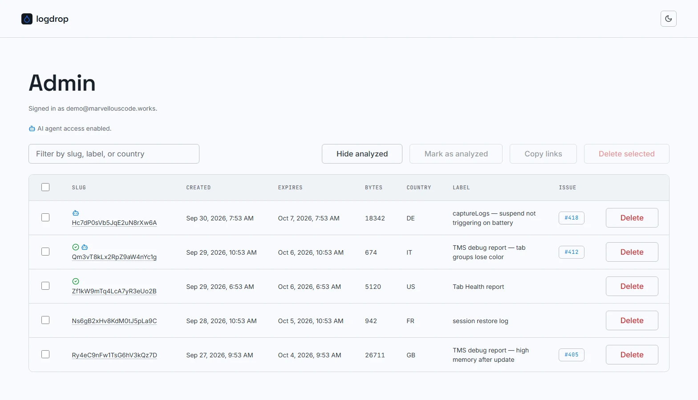
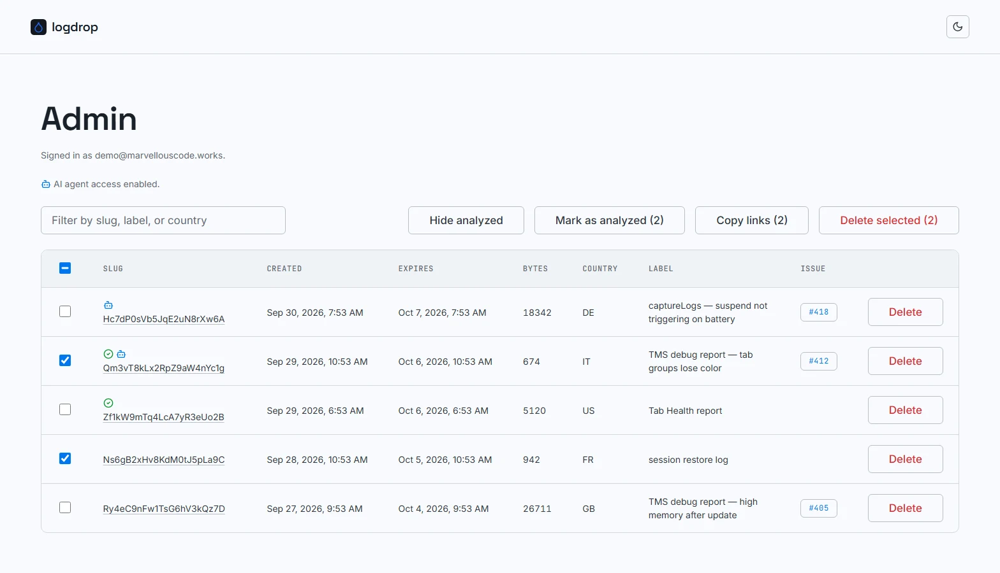

# Admin dashboard

The dashboard (`/admin`) lists every upload still stored on the instance, newest first. It's only reachable after [signing in](./admin-login).

---

## Header

- **Signed in as** shows the admin email of the current session.
- **AI agent access enabled.** appears right below, with a robot icon, only when the instance has `AGENT_API_TOKEN` configured. It tells you that an AI agent holding that token can read uploads through the [Agent API](./agent-api). The token itself is never shown. If the line is missing although you set the variable, see [Self-hosting](./self-hosting#environment-variables): the variable must be enabled for that Vercel environment, followed by a redeploy.

---

## Upload table

| Column | Content |
|---|---|
| Checkbox | Selects the row for [bulk actions](#bulk-actions). The header checkbox selects every *visible* row. |
| Slug | The upload's ID, linking to its [log view](./log-view). Badges appear above it, see below. |
| Created / Expires | Upload time and scheduled expiry, shown in your browser's locale and timezone. |
| Bytes | Size of the uploaded text. |
| Country | Uploader's country code, from Vercel's edge headers (may be empty). |
| Label | The optional label the uploader typed. |
| Issue | The linked GitHub issue as a clickable `#123` chip, if one was given. |
| Delete | Deletes that single upload, after a confirmation. |

### Badges

| Badge | Meaning |
|---|---|
| Green checkmark | The upload was **marked as analyzed** by a maintainer. Who did it, and when, is shown in the [log view](./log-view#activity). |
| Blue robot | An **AI agent has read** the upload through the [Agent API](./agent-api) at least once. How many times, and when last, is shown in the [log view](./log-view#activity). |

Both badges can appear on the same row.

:::note[Expired but still listed?]
The cleanup job runs once a day (03:00 UTC), so an upload can stay listed for up to a day after its expiry time. The Agent API already refuses expired uploads in the meantime.
:::

---

## Filter and toolbar

- **Filter** (text box) narrows the table as you type, matching the slug, label or country.
- **Hide analyzed** hides every row with the analyzed checkmark, so only work still to do is left. Click it again (**Show analyzed**) to bring them back. It combines with the text filter.

## Bulk actions

Select one or more rows and the toolbar buttons enable, each showing how many rows it will act on:

- **Mark as analyzed (N)** marks every selected upload as analyzed in one click, with no confirmation, and records you as the one who did it. The checkmark badge appears on each row, and the rows are deselected once done. To *unmark*, open the single upload's [log view](./log-view).
- **Copy links (N)** copies the selected uploads' links to the clipboard, one per line, e.g. to paste into an issue or a note.
- **Delete selected (N)** deletes every selected upload, after an on-screen confirmation (*"Delete N upload(s)? This can't be undone."*).

Mark and Copy flash green with a checkmark when they succeed.

:::warning
Deleting is permanent. There's no trash or undo, the content and its metadata are removed from storage immediately.
:::

---

## Theme

The sun/moon button in the top-right corner switches between light and dark theme. The choice is remembered in your browser; until you pick one, logdrop follows your system setting.
