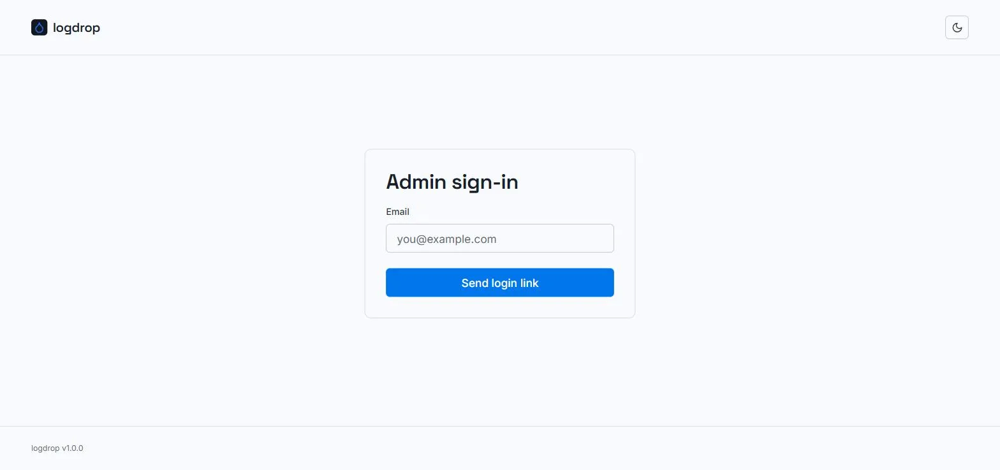

# Admin sign-in

logdrop has no passwords. Maintainers sign in with a **magic link** emailed to an address on the instance's allow-list (`ADMIN_EMAILS`).

---

## Signing in

1. Open `/admin` (or the **Admin** link in the top bar). You can also just open any upload link: without a session you're redirected to the sign-in page, and brought back to that upload afterwards.
2. Enter your email and click **Send login link**.
3. Open the email *"Your logdrop admin login link"* (with the logdrop logo and an *Admin sign-in* title) and click **Log in to logdrop** within **15 minutes**. If the button doesn't work, the same link is printed in plain text below it.
4. You land on the [admin dashboard](./admin-dashboard) (or the upload you were trying to open), signed in.

:::info[Same answer for everyone]
After you submit, the page always says *"If that email is registered, a login link is on its way"*, whether or not the address is on the allow-list. This is deliberate: the sign-in form can't be used to find out which addresses are admins. If no email arrives, double-check the address and your spam folder, then ask the instance operator whether you're on `ADMIN_EMAILS`.
:::

---

## Sessions

- A session lasts **7 days**, stored in an `HttpOnly`, `Secure` cookie. After that, sign in again.
- The allow-list is re-checked on **every request**. Removing an address from `ADMIN_EMAILS` revokes that admin's access immediately, without waiting for the session to expire.
- Magic links and session tokens are signed separately, so a login link can't be reused as a session and vice versa.

## Error messages

| Message | What to do |
|---|---|
| *That link expired. Request a new one below.* | The link is older than 15 minutes, was tampered with, or your address was removed from the allow-list. Request a new link. |
| *Missing login token.* | The link was truncated (common when copying it by hand). Click it directly from the email, or request a new one. |
