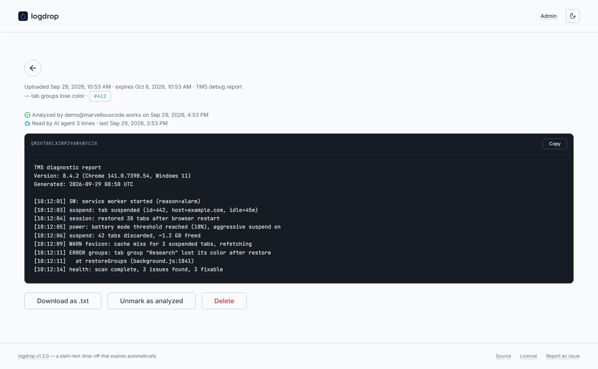
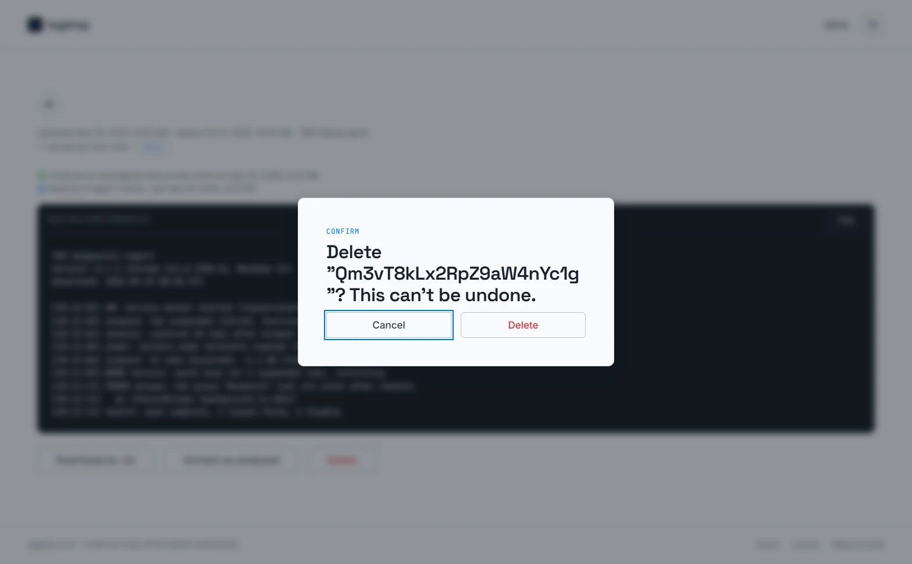

# Log view

Every upload has its own page at `/r/<slug>`, the same link the uploader shared. It opens only for a signed-in maintainer; anyone else is redirected to the [sign-in page](./admin-login), and a maintainer who signs in from there comes straight back to this upload.

---

## Details

The back-arrow button at the top returns to a freshly loaded [dashboard](./admin-dashboard).

Below it, a single line shows when the upload was **created**, when it **expires**, its **label** (if any) and the linked **GitHub issue** chip (if any). Times are shown in your browser's locale and timezone.

## Activity

Right under the details, logdrop shows what has happened to the upload so far:

- **Analyzed by `<admin email>` on `<date>`**, with a green checkmark, once a maintainer marked it as analyzed (here or in bulk from the dashboard). Hidden while the upload isn't analyzed.
- **Read by AI agent N time(s) · last `<date>` by `<admin email>`**, with a robot icon, once an AI agent read it through the [Agent API](./agent-api). Every successful agent read increments the count; *by* names the admin whose token performed the latest read (*the instance token* for the deprecated `AGENT_API_TOKEN`).

If neither has happened, the block isn't shown at all.

:::note[Uploads from before 1.2.0]
Who/when and agent reads are recorded starting with logdrop **1.2.0**, and whose token read it starting with **1.3.0**. Uploads analyzed with an earlier version just show **Analyzed**, without author and date, and agent reads before 1.3.0 show no *by*.
:::

---

## Content

The text is shown as-is in a monospaced block, labeled with the slug.

- **Copy** (top-right of the block) copies the whole text to the clipboard, flashing green on success.
- **Download as .txt** saves it as `logdrop-<slug>.txt`.

## Actions

- **Mark as analyzed / Unmark as analyzed** toggles the analyzed state with a single click, no confirmation. Marking records you and the current time; unmarking clears both. The activity line updates immediately, no reload needed.
- **Delete** removes the upload permanently, after a confirmation, then takes you back to the dashboard.

:::tip
If your session expired while the page was open, clicking **Mark as analyzed** sends you to the sign-in page and back here afterwards.
:::
