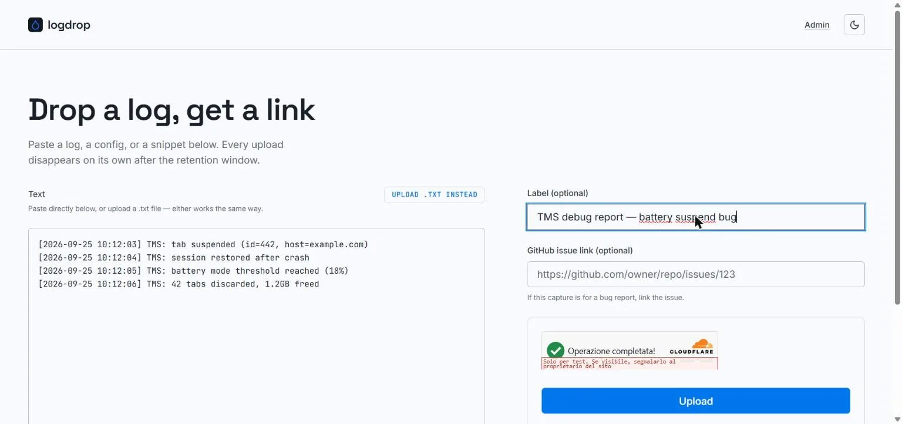
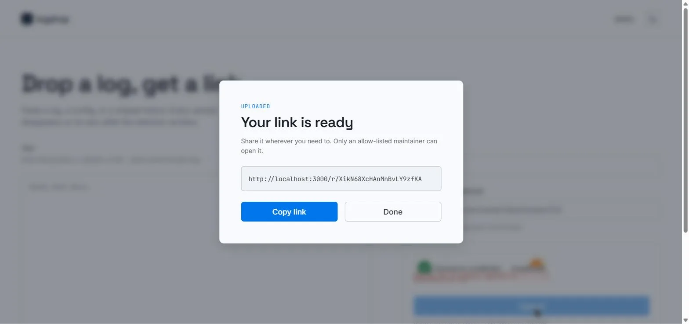

# Uploading a log

This page is for whoever is *sending* a log, for example a TMS user asked to attach a diagnostic report to a bug. No account is needed.

---

## Upload form

Open the logdrop instance you were pointed to (for TMS, [logdrop.marvellouscode.works](https://logdrop.marvellouscode.works)) and fill in:

### Text
Paste your log directly into the text area, or click **Upload .txt instead** to pick a file (`.txt` / `text/plain`). Either way works the same.

Only plain text is accepted: binary files, or text containing control characters other than tab and newlines, are rejected with *"Only plain text is accepted"*. The maximum size is 4 MB on the default configuration.

### Label (optional)
A short description of what this is, e.g. *"TMS debug report, battery suspend bug"*. It helps the maintainer recognize your upload. Labels longer than 200 characters are truncated.

### GitHub issue link (optional)
If the upload belongs to a bug report, paste the issue URL, e.g. `https://github.com/owner/repo/issues/123`. The maintainer sees it as a clickable `#123` chip. Only links in that exact GitHub issue format are kept; anything else is silently dropped.

### Verification
Complete the Cloudflare Turnstile check (usually automatic), then click **Upload**.

---

## Your link is ready

After a successful upload, a dialog shows your private link (`https://<instance>/r/<slug>`). Click **Copy link** and share it where you were asked to, typically in the GitHub issue.

:::tip[It's safe to post the link publicly]
The link only works for the instance's maintainers: anyone else who opens it is sent to a sign-in page they can't get past. You can paste it into a public issue thread without exposing the log's content.
:::

---

## After uploading

- **You can't read or delete it yourself.** Once uploaded, only the maintainers can open it. If you uploaded something by mistake, ask them in the issue to delete it.
- **It expires on its own.** The upload is deleted automatically after the retention window (7 days by default), whether or not anyone read it.
- **Upload again for a new capture.** Each upload gets its own link; there's no editing.

---

## Troubleshooting

| Message | What it means |
|---|---|
| *Please complete the verification widget.* | The Turnstile check hasn't finished. Wait for it (or reload the page) and try again. |
| *Verification failed* | Turnstile rejected the token, often because it expired. Reload the page and retry. |
| *Invalid upload size* | The text is empty or larger than the instance's limit (4 MB by default). Trim the log or split it into several uploads. |
| *Only plain text is accepted* | The content isn't valid UTF-8 text, or contains control characters. Upload the raw text log, not a zip, PDF or screenshot. |
| *Uploads are temporarily disabled* | The operator switched uploads off (see [kill-switch](./self-hosting#upload-kill-switch)). Try again later. |
| *Upload failed* | Anything else, usually a server-side problem. Try again later, and if it persists, report it on [GitHub](https://github.com/Marvellous-Codeworks/logdrop/issues). |
